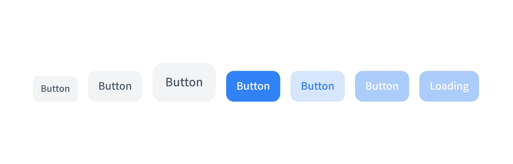

2022년부터 거의 [다운로드 양이 약 3배 가량 증가한](https://www.npmtrends.com/tailwindcss) 최근 아주 핫한 🔥 Tailwind CSS란 것을 사용해보고, 블로그에 적용하면서 어떤 어려움이 있었고, 어떤 식으로 해결하고 사용하였는지 공유하고자합니다.

## Tailwind CSS란?

> A **utility-first CSS framework** packed with classes like `flex`, `pt-4`, `text-center` and `rotate-90` that can be composed to build any design, directly in your markup. ([Tailwind CSS 공식 문서 중](https://tailwindcss.com/))

Tailwind CSS 공식문서에 잘 나와있듯, Tailwind CSS는 Utility First 컨셉을 가진 CSS 프레임워크입니다. 기존의 CSS나 SASS를 작성하는 것이 아닌 이미 작성된 `flex`, `pt-4`, `text-center`과 같은 유틸리티 클래스를 활용하는 방식으로 HTML 코드 내에서 스타일링 할 수 있습니다.

Tailwind CSS의 장점과 단점 기본적인 사용법에 대해서는 [워니님의 블로그](https://wonny.space/writing/dev/hello-tailwind-css)에 잘 나와있기에 참고하시면 처음 시작하실 때 좋을 것 같습니다.

## Tailwind CSS 잘 사용하기

제가 이번에 이야기하고 싶은 것은 Tailwind CSS를 사용하면서, 내가 느꼈던 문제점을 공유하고, 나는 어떻게 해결하였는지 같이 이야기해보고자 합니다.

### 클래스 유틸리티 사용하기

[classnames](https://github.com/JedWatson/classnames)나 [clsx](https://github.com/lukeed/clsx) 와 같은 조건부 클래스 유틸리티를 사용한다면 조금 더 가독성이 좋은 코드를 작성할 수 있습니다. 예를 들어, 텍스트의 타입마다 스타일이 바뀌어야 한다면, 기존에는 템플릿 리터럴을 활용하여서, 다음과 같이 작성하였습니다.

```typescript
export default function Text({ content, contentType }: TextProps) {
  return (
    <p
      className={`
          ${
            contentType === 'title'
              ? 'text-lg font-bold tracking-tight'
              : 'text-sm text-grey-600'
          }
        `}
    >
      {content}
    </p>
  );
}
```

이렇게 사용하다보면, 분기 처리가 많아 질 때마다, 어떤 경우에 어떠한 스타일이 적용되는지 한 눈에 알아보기 힘들어집니다.

하지만, `classnames`와 같은 조건부 클래스 유틸리티를 사용하였을 때는 아래와 같이 조금 더 편리하고 가독성 좋게 사용할 수 있습니다.

```typescript
export default function Text({ content, contentType }: TextProps) {
  return (
    <p
      className={classNames(
        { 'text-lg font-bold tracking-tight': contentType === 'title' },
        { 'text-sm text-grey-600': contentType === 'description' },
      )}
    >
      {content}
    </p>
  );
}
```

### 클래스를 변수에 할당하여 사용하기

저는 컴포넌트를 설계할 때 재사용할 수 있게 각 **사이즈(size)**, **타입(variant)** 별로 다른 스타일을 적용할 수 있는 등의 다양한 옵션을 사용할 수 있는 방법으로 설계하는 편입니다.

이전에는 `styled-compnent`를 사용하였을 때에는 각각의 사이즈와 타입에 맞는 컴포넌트를 만들었었지만, 이번에 Tailwind CSS는 각 옵션에 맞는 스타일(클래스 이름)을 객체별로 분리하여서 위에서 사용한 `classNames`를 활용해서, 컴포넌트를 만들어 보았습니다.

```typescript
// Button.styles.ts
export const buttonDefaultStyles /* tailwindcss */ =
  'font-medium hover:opacity-75 disabled:opacity-40';

export const buttonVariantStyles /* tailwindcss */ = {
  default: 'bg-grey-100 text-grey-700 dark:bg-grey-800 dark:text-grey-300',
  primary: 'bg-blue-500 text-white',
  secondary: 'bg-blue-500 bg-opacity-20 text-blue-500',
};

export const buttonSizeStyles /* tailwindcss */ = {
  sm: 'text-sm py-2.5 px-3 rounded-lg',
  md: 'text-base py-3 px-4 rounded-xl',
  lg: 'text-lg py-4 px-5 rounded-2xl',
};

export type ButtonVariant = keyof typeof buttonVariantStyles;
export type ButtonSize = keyof typeof buttonSizeStyles;
```

```typescript
// Button.tsx
export default function Button({
  label,
  isLoading,
  disabled,
  className,
  size = 'md',
  variant = 'default',
  ...buttonProps
}: ButtonProps) {
  return (
    <button
      className={classNames(
        buttonDefaultStyles,
        buttonSizeStyles[size],
        buttonVariantStyles[variant],
        className,
      )}
      disabled={isLoading || disabled}
      {...buttonProps}
    >
      {isLoading ? 'Loading' : label}
    </button>
  );
}
```



이전의 `styled-component`보다 코드도 간결하고 사용성도 나쁘지 않았습니다.

### 💡Tip: Tailwind Intellisense에 나만의 Regex 적용하기

Visual Studio Code에 [TailwindCSS IntelliSense](https://marketplace.visualstudio.com/items?itemName=bradlc.vscode-tailwindcss) 를 사용하면, AutoComplete, Linting, Hover Preview(Hover시에 실제 CSS 코드 확인)과 같은 매우 편리한 기능을 사용할 수 있습니다.

하지만, `html`태그나 `jsx`태그등의 클래스에만 적용이 됩니다. 하지만, 위에서 제가 사용한 방식처럼 변수에 할당하여서 사용하고 싶다면 적용이 안되는 문제점이 있습니다. TailwindCSS Intellisense의 Github에 해당 이슈를 참고해서 제가 원하는 방식으로 해결하였습니다. [**Github Issue**](https://github.com/tailwindlabs/tailwindcss/issues/7553)

아직, **experimental**이긴 하지만, 자신만의 클래스라고 판단하는 정규표현식을 `tailwindCSS.experimental.classRegex` 라는 옵션을 통해서 지원합니다. 저는 제가 사용하려는 변수 앞에 `/* tailwindcss */` 라는 주석을 통해서, Intellisense를 적용하게 하였습니다.

```json
// settings.json
{
  "tailwindCSS.experimental.classRegex": [
    ["/\\* tailwindcss \\*/ ([^;]*);", "'([^']*)'"]
  ]
}
```

**사용예시**

```typescript
export const buttonVariantStyles /* tailwindcss */ = {
  default: 'bg-grey-100 text-grey-700 dark:bg-grey-800 dark:text-grey-300',
  primary: 'bg-blue-500 text-white',
  secondary: 'bg-blue-500 bg-opacity-20 text-blue-500',
};
```

### Prettier 플러그인

```typescript
<div className="inline-block w-28 md:w-36 mt-4 md:mt-6 md:pt-3 md:pb-4 rounded-full text-sm leading-10 md:text-base font-bold tracking-tight bg-custom-200 dark:bg-custom-600 hover:opacity-50 transition-opacity">
```

위 처럼 하나의 요소에 많은 CSS를 설정해야 하는 경우가 있습니다. 그런 경우 class이름 이 너무 길어져서 모든 내용이 한눈에 다 들어오지 않기 때문에,
앞에 있는 class를 인지하지 못하고 뒤에 똑같은 class를 추가할 수 있습니다.

이런 경우, [Prettier 플러그인](https://github.com/tailwindlabs/prettier-plugin-tailwindcss)을 사용하면 각각의 클래스 이름들을 특정 규칙에 맞게 정렬해줍니다.
물론, [나만의 컴포넌트 클래스](https://tailwindcss.com/docs/adding-custom-styles#adding-component-classes)로 만들어서 사용하는 것도 좋은 방법이 될 수도 있습니다.

Tailwind CSS는 다양한 플러그인들이 있고 여기서 나의 입맛에 맞는 것들을 쏙쏙 뽑아 쓴다면 매우 좋을 것 같습니다.

## 맺음말

아직 많은 곳에 적용해본 것은 아니지만, 개인적으로는 매우 만족하면서 사용해보고 있고 아직 안 써보신 분들이라면 한 번 써보면 좋을 것 같습니다.

미약한 내 블로그의 글들을 읽고 계신 다른 분들도 어떤 어려움이 있었고 어떻게 해결했는지 댓글로 남겨주시고 공유해주시면 감사하겠습니다.

## 참조

[Tailwind CSS 공식 문서](https://tailwindcss.com/docs)

[워니님 블로그 - Hello Tailwind CSS!](https://wonny.space/writing/dev/hello-tailwind-css)

[Kakao Ent Blog - Tailwind CSS 사용기](https://fe-developers.kakaoent.com/2022/220303-tailwind-tips/#preflight-%EC%B2%98%EB%A6%AC)
