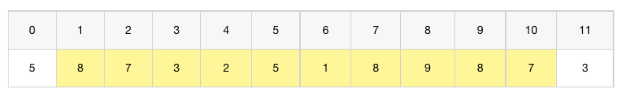
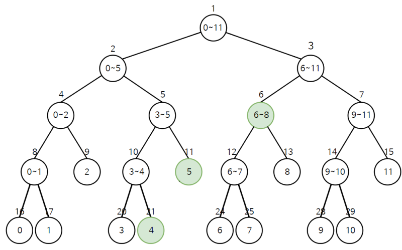
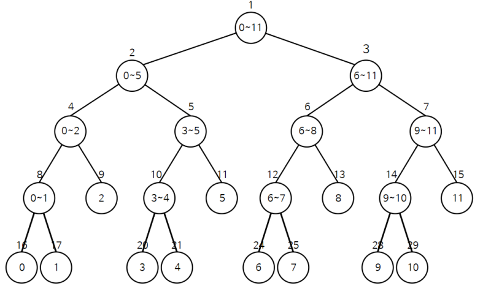

## 세그먼트 트리 (Segment Tree)

배열의 부분 합을 구할 때 사용하는 개념

배열의 값이 지속적으로 바뀌는 경우, 단순하게 부분 합을 다시 구하는 경우에는 $O(N)$ 만큼의 시간이 걸리기 때문에, 이를 트리로 구현하여 $O(log N)$의 시간으로 해결하는 방법



## 구현

**세그먼트 트리**는 **이진 트리 구조**랑 동일하며,

1. **부모 노드의 값은 양 쪽 자식 노드 값의 합**
2. **기존 배열의 요소들은 리프 노드**

실제로 **세그먼트 트리**를 구현할 때에는 Node 클래스를 따로 구현하지 않고, 단순하게 **1차원 배열**과 **인덱싱**을 통해 구현



- `rootNode`의 **Index**는 1
- `leftChild`의 **Index**는 **현재 Index \* 2**
- `rightChild`의 **Index**는 **현재 Index \* 2 + 1**
- 필요한 1차원 배열의 크기는 보통 $(4 \times N)$ 또는 $2^{(logN+1)}$
  N개의 배열에 대한 세그먼트 트리를 만들게 되면, 리프 노드의 개수가 $N$개가 되고, 트리의 높이는 $logN$이 되고 필요한 배열의 크기는 $2^{(logN+1)}$이 된다.

예를 들어, 4~8까지의 구간 합을 구하는 경우 다음과 같이 3개의 노드의 합을 구함으로 써, $O(log N)$의 시간으로 구할 수 있다.

## Example

```python
arr = [5, 8, 7, 3, 2, 5, 1, 8, 9, 8, 7, 3]
tree = [0] * (4 * len(arr))
```

### Init

```python
def init(start: int, end: int, node: int):
    """Init Segment Tree
    Args:
        start (int): arr의 시작 인덱스
        end (int): arr의 마지막 인덱스
        node (int): tree의 인덱스

    Returns:
        value (int): node의 value
    """
    if start == end:
        tree[node] = arr[start]
        return tree[node]

    # 재귀적으로 오른쪽 자식과 왼쪽 자식의 합을 리턴
    mid = (start + end) // 2
    left_node = init(start, mid, node * 2)
    right_node = init(mid + 1, end, node * 2 + 1)
    tree[node] = left_node + right_node
    return tree[node]

# 세그먼트 트리 초기화
init(0, len(arr)-1, 1)
```

### Sum

```python
def sum(start: int, end: int, node: int, left: int, right: int):
    """구간 합 구하기
    Args:
        start (int): arr의 시작 인덱스
        end (int): arr의 마지막 인덱스
        node (int): tree의 인덱스
        left (int): 구하고자 하는 구간 값의 시작 인덱스
        right (int): 구하고자 하는 구간 값의 마지막 인덱스
    Returns:
        value (int): node의 value
    """
    # 범위 밖에 있는 경우
    if left > end or right < start:
        return 0
    # 범위 안에 있는 경우
    if left <= start and end <= right:
        return tree[node]

    mid = (start + end) // 2
    left_sum = sum(start, mid, node * 2, left, right)
    right_sum = sum(mid + 1, end, node * 2 + 1, left, right)
    return left_sum + right_sum

# 4 ~ 8 까지의 구간 합 구하기
sum(0, len(arr)-1, 1, 4, 8)
```



### Update

```python
def update(start: int, end: int, node: int, index: int, diff: int) -> None:
    """트리의 갑 변경 (기존 배열은 따로 변경)
    Args:
        start (int): arr의 시작 index
        end (int): arr의 마지막 index
        node (int): tree의 index
        index (int): 변경하고자 하는 배열의 index
        diff (int): 기존 배열과 변경하고자 하는 값의 차이
    """
    # 범위 밖에 있는 경우, 변경하지 않음
    if index < start or end < index:
        return
    # 범위 안에 있으면 재귀적으로 내려가면서 노드 값 변경
    tree[node] += diff
    # 리프 노드는 더 이상 변경하지 않음
    if start == end:
        return
    mid = (start + end) // 2
    update(start, mid, node * 2, index, diff)
    update(mid + 1, end, node * 2 + 1, index, diff)

# 기존 배열의 9(index=8)를 4로 변경
update(0, len(arr)-1, 1, 8, 4-9)
arr[8] = 4
```

## 문제

[백준 알고리즘 - 세그먼트 트리 ](https://www.acmicpc.net/problemset?sort=ac_desc&algo=65)

## 참조

[네이버 블로그](https://m.blog.naver.com/ndb796/221282210534)
