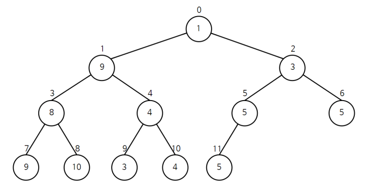
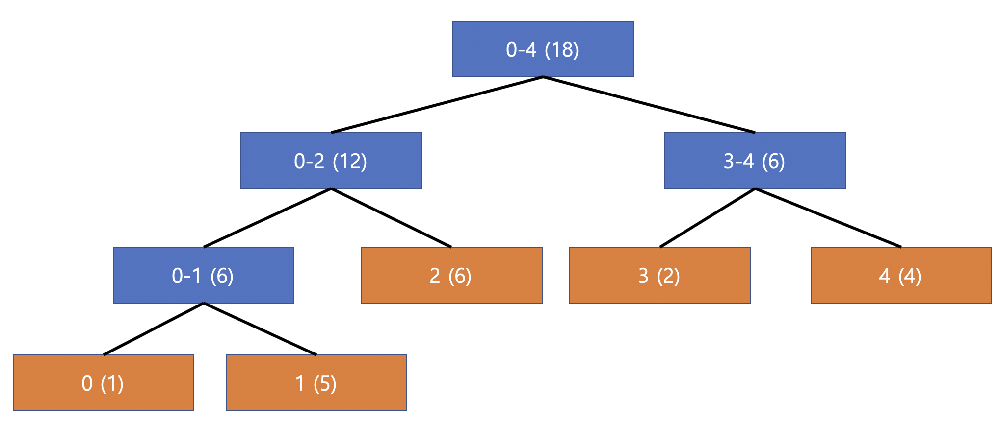
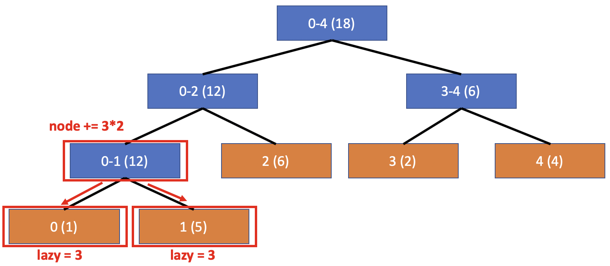
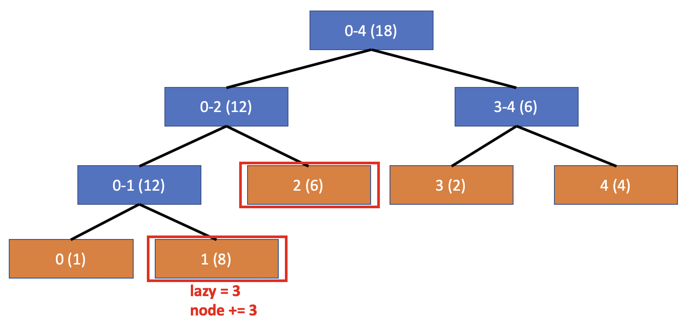

## Lazy Propagation



기존 세그먼트 트리에서 하나의 리프 노드를 업데이트 할 때 $O(logN)$이 걸리게 되고, `start` ~ `end`의 구간의 값을 업데이트하는 경우 최대 $O(N \times logN)$의 시간이 걸리게 된다.

따라서, 이러한 구간 업데이트를 $O(logN)$ 만에 수행하기위해 필요한 것이 **Lazy Propagation**이다.

**Lazy Propagation**은 이름의 뜻 그대로 **게으르게(lazy)** **전파(propagation)** 한다는 것으로 특정 업데이트 구간에 포함되는 노드들에게 나중에 전파시킬 값을 저장해 두고 다음 업데이트나 쿼리를 할 때 마다 자식 노드들에게 전파하는 것이다.

## 예시

배열 `[1,5,6,2,4]`에 대해서 구간 합 예시를 통해 알아보자.



세그먼트 트리는 위와 같이 구성되며, 여기서 구간 `0~1` 에 `3`을 더한다고 해보자.



`0~1` 에 해당하는 노드 하위 노드들에게 더 할 값이 `3`이 있고 현재 노드를 업데이트 해주자는 것이다.

**단, 주의할 점은 현재 노드에 업데이트 해 줄 때 자식 노드들의 개수를 곱해줘야 한다.**

여기서, 자식 노드들에게 초기화시킨 `lazy` 배열의 값은 나중에 다시 업데이트를 하거나 쿼리를 날릴 때 해당 값을 사용하여 자식들을 업데이트하고 `propagation`을 시키기 위함이다.

이를 보기 위해 이번엔 구간 쿼리인 `1-2` 를 날렸다고 해보자.



그럼 위와 같이 쿼리를 날리게 되면 먼저 `lazy` 값을 가지는지 확인을 한 다음 자식으로 `propagation`을 시키는데, 위의 경우는 리프노드가 `lazy` 값을 가지고 있기 때문에 바로 노드에 더해버린다.

## 과정

- **구간 업데이트**
  - **Propagation**
  - 업데이트 구간 안에 속하는 경우, 현재 노드 업데이트 해주고 자식의 `lazy` 값 업데이트
  - 나머지는 기존 세그먼트 트리의 업데이트와 동일
- **구간 쿼리**
  - **Propagation**
  - 나머지는 기존 세그먼트 트리의 쿼리와 동일
- **Propagation**
  - `lazy` 값 있는지 확인
  - 해당 `lazy` 값으로 현재 노드 업데이트
  - 리프노드가 아닐 경우 자식으로 전파
  - 마지막에 현재 노드의 `lazy` 값을 초기화 → 업데이트 해주었으니 나중을 위해서 초기화해야함

## 구현

**Lazy Propagation**을 구현하기 위해서 각 노드는 `lazy` 배열을 가지며 이는 다음 업데이트나 쿼리에 대해서 현재 노드를 포함한 모든 `자식 노드`들에 적용되는 값을 가지는 배열을 뜻한다. 이를 통해 한번에 업데이트 하지 않고 `lazy` 배열을 참조하여 업데이트가 필요할 때만 해 줄 수 있게 된다.

### Segment Tree

```python
class SegmentTree:
    def __init__(self, arr):
        self.arr = arr
        self.length = len(arr)
        self.tree = [0] * (self.length * 4)
        self.lazy = [0] * (self.length * 4)
        self.init_tree(0, self.length - 1, 1)

    def init_tree(self, start: int, end: int, node: int):
        if start == end:
            self.tree[node] = self.arr[start]
            return self.tree[node]

        mid = (start + end) // 2
        left_node = self.init_tree(start, mid, node * 2)
        right_node = self.init_tree(mid + 1, end, node * 2 + 1)
        self.tree[node] = left_node + right_node
        return self.tree[node]
```

### Propagation

```python
def propagation(self, start: int, end: int, node: int):
		# lazy 값이 있는지 확인
		if self.lazy[node]:
				# 현재 노드를 lazy값으로 업데이트
				# 현재 노드의 해당 범위만큼 곱해서 업데이트
		    self.tree[node] += (end - start + 1) * self.lazy[node]
				# 리프 노드가 아닌 경우, 내 자식(왼쪽, 오른쪽)으로 전파
				# 자식 노드의 lazy값 변경
		    if start != end:
		        self.lazy[node * 2] += self.lazy[node]
		        self.lazy[node * 2 + 1] += self.lazy[node]
				# 현재 노드의 lazy값 초기화
		    self.lazy[node] = 0
```

### Query

```python
def query(self, start: int, end: int, node: int, left: int, right: int):
		# 현재 노드를 lazy값으로 업데이트
		self.propagation(start, end, node)

		# 범위 안에 없는 경우
		if right < start or left > end:
		    return 0

		# 범위 안에 있는 경우
		if left <= start and end <= right:
		    return self.tree[node]

		# 범위에 걸쳐 있는 경우
		mid = (start + end) // 2
		left_node = self.query(start, mid, node * 2, left, right)
		right_node = self.query(mid + 1, end, node * 2 + 1, left, right)
		return left_node + right_node
```

### Update

```python
def update(self, start: int, end: int, node: int, left: int, right: int, diff: int):
		# 현재 노드를 azy값으로 업데이트
    self.propagation(start, end, node)

		# 범위 안에 없는 경우
    if right < start or left > end:
        return

		# 범위 안에 있는 경우
    if left <= start and end <= right:
				# 해당 노드 값을 범위의 크기 만큼 업데이트
        self.tree[node] += (end - start + 1) * diff
				# 리프 노드가 아닌 경우, 자식 노드의 lazy값 변경
        if start != end:
            self.lazy[node * 2] += diff
            self.lazy[node * 2 + 1] += diff
        return

		# 범위에 걸쳐 있는 경우
    mid = (start + end) // 2
    self.update(start, mid, node * 2, left, right, diff)
    self.update(mid + 1, end, node * 2 + 1, left, right, diff)
    self.tree[node] = self.tree[node * 2] + self.tree[node * 2 + 1]
```

## 문제

[백준 - LazyPropagation](https://www.acmicpc.net/problemset?sort=ac_desc&algo=66)

## 참고

[[알고리즘] Lazy Propagation](https://baeharam.github.io/posts/algorithm/lazy-propagation/)

[Lazy Propagation in Segment Tree - GeeksforGeeks](https://www.geeksforgeeks.org/lazy-propagation-in-segment-tree/)
