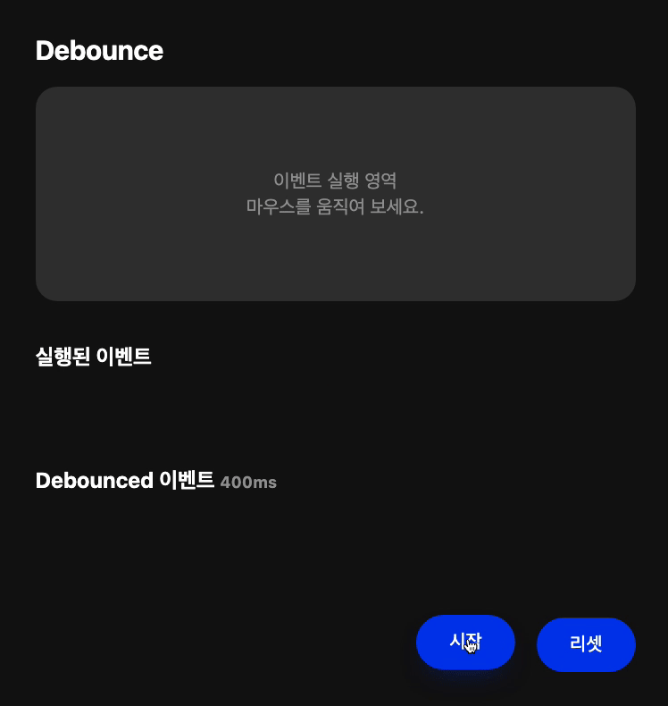
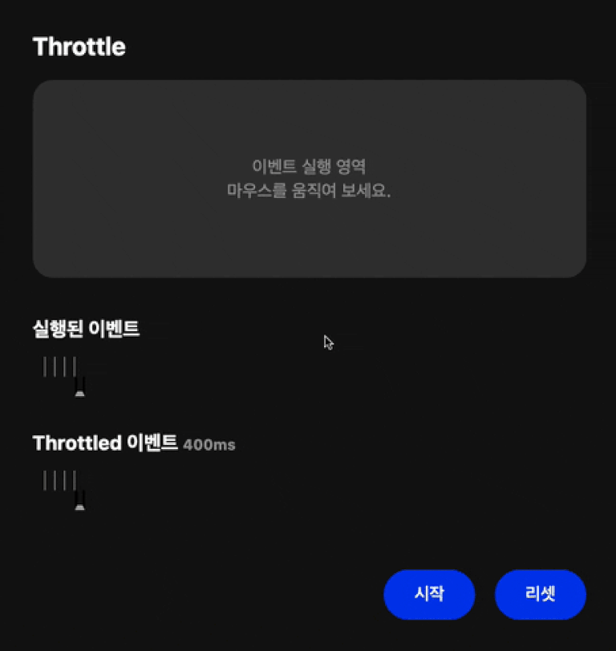
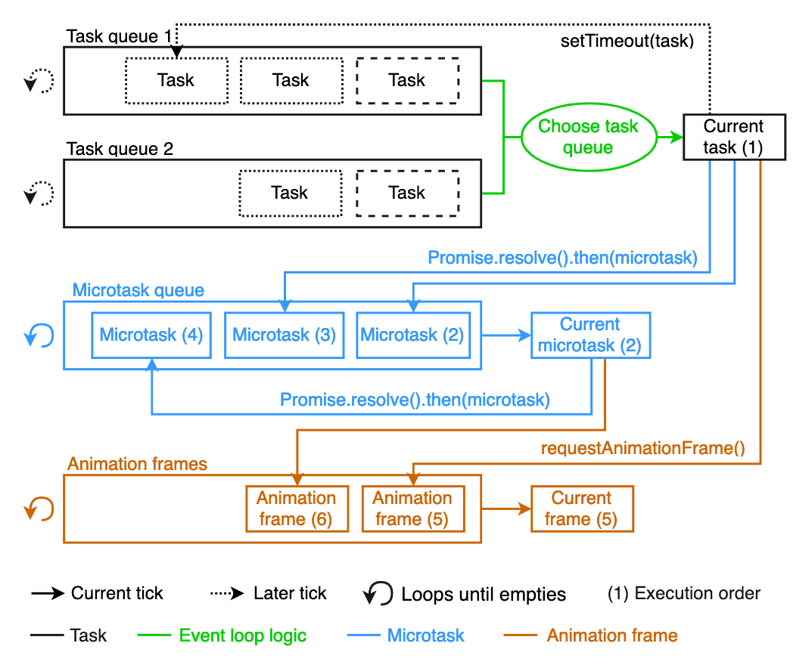

이벤트가 발생하면, 해당 이벤트에 해당하는 Callback 함수가 Task Queue(Callback Queue)에 쌓이게 되고, JavaScript CallStack이 비었다면 Callback 함수를 실행하게됩니다.
하지만, Scroll Event 또는 Input Event등과 같이 짧으 시간에 정말 많은 이벤트가 발생하면,
계속해서 Task Queue에 쌓이게되고 불필요한 CallStack이 지나치게 많아져서 성능 저하를 가져올 수 있습니다.

이러한, 문제를 해결하기 위한 방법에 대해서 알아봅시다.

## Debounce와 Throttle

### Debounce란?

> 요청이 들어오고 일정 시간을 기다린 후 요청을 수행한다. 만약 일정 시간 안에 같은 요청이 추가로 들어오면 이전 요청은 취소된다. 즉, 가장 마지막 요청만을 수행한다.

debounce는 위에 설명한 것처럼, 일정시간 내에 발생한 많은 이벤트를 통한 요청 중 가장 마지막 요청만을 수행합니다. 물론, 마지막 요청은 일정시간 기다린 후에 수행합니다.

이러한 방식은, 동일한 이벤트가 여러 번 발생하면 모든 Callback 함수가 Task Queue에 쌓이는 것이 아니라,
`setTimeout`을 사용해서 일정 시간(`wait`) 이후에 쌓이게 하여서, 쌓이기 전의 Callback 함수가 있다면,
취소하고(`clearTimeout`) 새로운 `setTimeout(Callback)`의 호출을 통해서 다시 일정시간 이후에 쌓이게 함으로써 구현합니다.



위의 애니메이션을 보면 연속적으로 실행된 이벤트 모두 실행되는 것이 아니라 일정시간 이후에 실행되는 것을 볼 수 있습니다.
이를 코드로 구현하면 아래와 같습니다.

```javascript
function debounce(callback, wait) {
  var debounced = null;
  return function () {
    // 다시 한 번 호출된다면, 기존의 setTimeout을 초기화 합니다.
    clearTimeout(debounced);

    // 콜백 함수를 setTimeout을 통해 호출합니다.
    debounced = setTimeout(function () {
      callback.apply(this, arguments);
    }, wait);
  };
}
```

위 코드를 간략하게 설명하면, 아래와 같습니다.

- 이벤트가 발생합니다.
- `setTimeout`을 통해서 `wait` 후에 `callback`가 호출됩니다.
- `wait`시간 이전에 이벤트가 발생하면, `clearTimeout`을 통해 이전에 호출된 `setTimeout`을 취소합니다.
- 다시 한번, `setTimeout`을 통해서 `wait` 후에 `callback`가 호출됩니다.

### Throttle란?

> 일정시간 동안 요청이 한 번만 수행되도록한다.

throttle은 debounce와 다르게 일정시간 동안 하나의 이벤트만 실행합니다.



위의 애니메이션을 보면 연속적으로 실행된 이벤트 모두 실행되는 것이 아니라 일정시간동안 하나의 이벤트만 실행됩니다.
이를 코드로 구현하면 아래와 같습니다.

```javascript
function throttle(callback, wait) {
  var throttled = false;
  return function () {
    // throttled가 false라면 callback을 호출합니다.
    if (!throttled) {
      // callback이 호출되면 throttled는 true가 됩니다.
      callback.apply(this, arguments);
      throttled = true;
      // 일정 시간(wait)이 지난 후에 다시 throttled는 false가 됩니다.
      setTimeout(() => {
        throttled = false;
      }, wait);
    }
  };
}
```

위 코드를 간략하게 설명하면, 아래와 같습니다.

- 이벤트가 발생합니다.
- `callback` 함수가 호출되고, `throttled`는 `true`가 됩니다.
- `setTimeout`을 통해서 `wait` 후에 `throttled`가 `false`가 됩니다.
- `throttled`가 `false`은 `wait` 시간동안 실행되는 이벤트의 `callback`은 호출되지 않습니다.

## requestAnimationFrame

`lodash`의 `debounce` 구현부를 보면 `wait=0`이라면 `setTimeout`이 아닌 `requestAnimationFrame`으로 Callback 함수를 호출합니다. 왜 그러는걸까요?

### requestAnimationFrame이란?

> window.requestAnimationFrame()은 브라우저에게 수행하기를 원하는 애니메이션을 알리고 다음 리페인트가 진행되기 전에 해당 애니메이션을 업데이트하는 함수를 호출하게 합니다. 이 메소드는 리페인트 이전에 실행할 콜백을 인자로 받습니다. (MDN 공식 문서)

`requestAnimationFrame`은 브라우저가 렌더링 할 수 있는 **능력**에 맞춰 callback 함수를 호출할 수 있습니다.
따라서, `throttle` 처럼 굳이 400ms씩 호출 하려고 하지 않아도 되는 것입니다.
callback의 수는 보통 1초에 60회지만, 일반적으로 대부분의 브라우저에서는 W3C 권장사항에 따라 그 수가 디스플레이 주사율과 일치하게됩니다.

또한, `setTimeout`과 마찬가지로 callback으로 넘겨지는 function을 비동기 task로 분류하여 처리합니다.
다만 `requestAnimationFrame`은 Task Queue가 아니라 Animation Frame에서 처리됩니다.

이벤트 큐의 우선순위는 다음과 같습니다.

1. Call Stack 작업을 처리한다.
2. Call Stack이 비어있다면 Microtask Queue를 확인하고 작업이 있다면 Microtask Queue의 task를 작업을 Call Stack으로 넣고 처리한다.
3. 만약 microtask가 비어있다면 Animation Frame를 확인하고 브라우저 렌더링이 발생한다.
4. 1, 2, 3번 작업이 완료되었다면 Task Queue를 확인하고 작업이 있다면 Task Queue의 작업을 Call Stack으로 넣고 처리한다.

따라서, `setTimeout`과 `setInterval`과 다르게 렌더링 이전에 우선적으로 처리 됩니다.



### setInterval보다 requestAnimationFrame의 장점?

이전에는 `setInterval`을 사용해서, 연속된 애니메이션을 구현했다면, 최근에는 아래와 같은 이유로 `requestAnimationFrame`을 사용합니다.

- 우리가 직접 최적화하는 것이 아닌 브라우저에서 최적화합니다.
- 활성화 되지 않은 탭에서는 멈추게 된다.
- 배터리를 절약할 수 있다. (특히, 모바일 환경)
- 프레임 유실이 발생할 수 있다.

## 예시로 사용된 Event Animation

https://stackblitz.com/edit/js-ir2x4v

## 참조

- [lodash/debounce](https://github.com/lodash/lodash/blob/master/debounce.js)
- [BGSMM님 블로그](http://yoonbumtae.com/?p=3584)
- [MDN, requestAnimationFrame](https://developer.mozilla.org/ko/docs/Web/API/window/requestAnimationFrame)
- [JBEE님 블로그](https://jbee.io/web/optimize-scroll-event)
